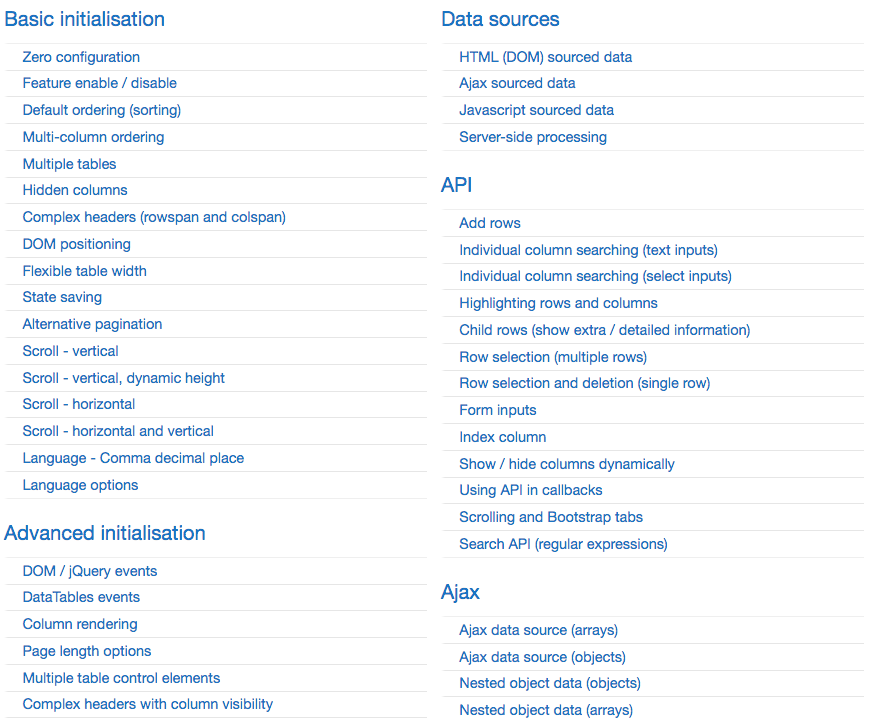
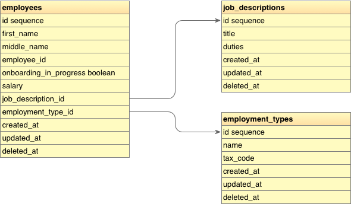
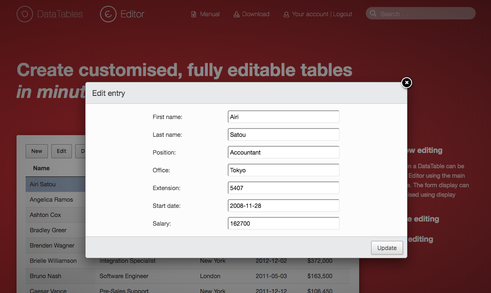

# [fit] Cool table UX 
## with DataTables.net & Laravel
#### Presented by Nick Evans, Senior Dev @ Northwestern IT


---

# DataTables.net
- Open source JS library for Fancy Tables
    - Needs jQuery
    - Plays nice w/ Bootstrap, Semantic, jQuery UI

- Pretty nice out of the box
    - The docs have a showcase w/ all the different features (& example code)

- Use it as the core of an app's UX: the main page that lists all the stuff people interact with

^ This talk isn't *just* about Laravel. There's stuff here for you if you just want ideas on using DT.n.

---

# [fit] Examples



---


^ This is what you get when you instantiate it on a table. In the example, the table has data (in `<tr>`s) already.

---


^ So here we see column select (w/ one column not hidable and one not shown by default), multi-column sort, CSV export, not default visibility, sticky header

^ This is just a showcase for some of the cooler features you get. There are even more -- column groups, complex headers, reorderable columns, etc.

^ Codepen for this: https://codepen.io/nie7321/full/jjXGNL

---

# AJAX
- DT.n has full support for making everything server-side
    - Pagination & sorting
    - Search across all columns
    - Search specific columns
    - Exports

^ Sometimes with small tables, you can get away with just dumping your whole dataset into the page as JSON and doing client-side manipulations. But that doesn't scale.

^ So it has a whole thing for communicating with the server. It can get kind of complicated when you add more and more features, like multi-column sorting and a bunch of filters.

---


^ Don't worry, it's all fake data (:hearts: faker)

^ This one is server-side in a Laravel app. You notice this is starting to not look like DataTables.net anymore. A lot of its stock UI elements have been stripped and replaced with buttons and the sidebar panels containing per-field search filters.

^ We used to have checkboxes too, which interacted w/ DataTables.net Buttons for server-side shenanigans.

---

# Laravel
- Popular PHP framework
- Eloquent ORM
- `yajra/laravel-datatables` translates all the inputs from DT.n into the expected outputs
    - And it uses your models to do it

^ I'm Northwestern's foremost member of the Laravel cult, so I obviously am going to talk about it !

^ Pushing all the hard processing off the client and onto the server is great.

---

# [fit] Let's do it!

^ OK so now we're going to go through setting everything up and writing some code.

^ Haven't risked live-coding before a studio audience before. Wish me luck.

---

# Setup DT.n JS libs in Laravel
- Install DT.n and desired addons via yarn
    - `yarn add datatables.net datatables.net-bs4 datatables.net-buttons datatables.net-buttons-bs4 datatables.net-dt`

- Add to app.js (via bootstrap.js) & app.css, compile
    - `yarn run dev`

- I have a template w/ a basic initialization to see if we've installed it properly
    - I also set up a site layout w/ the mix'd assets
    - Table is copied from the DT.n basic initialization example
    - Magic is in the JS
        - A little bit of extra magic to enable colvis button + align properly for Bootstrap

^ We will start with a brand-new Laravel app skeleton. The DT.n packages are all up on the NPM package registry, so I'll yarn install them. 

^ I will be using the Bootstrap styling for DT.n, cuz Laravel already has Bootstrap in its `packages.json`. 

^ We're grabbing the DT.n Buttons extension, which has our column visbility & CSV/Excel/etc buttons.

^ Laravel Mix is the asset pipeline. It's webpack, except a smart person figured everything out and then gave us a Fisher-Price config file. Big fan, but it's another talk :-)

^ I've got the dependencies already installed. Take a look at the bootstrap.js & app.css files, then look at the first view!

---

# Setup `laravel-datatables`
- Install Laravel package - Eloquent <-> JSON 'protocol' for DT
    - `composer require yajra/laravel-datatables`
    - `php artisan vendor:publish --tag=datatables && php artisan vendor:publish --tag=datatables-buttons`
    - Docs @ https://yajrabox.com/docs/laravel-datatables

- Put `buttons.server-side.js` into the Mix
    - `mv public/vendor/datatables/buttons.server-side.js resources/js/`
    - Update `app.js` & rebuild

^ The package we're installing comes with support for DT.n Buttons & DT.n Editor. Can install more specific packages if you want less. 

^ The second command will publish its configs to the `config/` directory. There are some settings here that control how searching works (case sensitivity, wildcards, etc). The defaults are fine for this demo, though!

^ The buttons publish will also drop a `buttons.server-side.js` file in your `public/js` dir. We'll just put that into the Mix pipeline instead. This tells the built-in CSV/etc buttons to do an AJAX request instead to get all pages of data!

---

# DataTables as a Service
- DT service class is how I prefer to use this
    - There are simpler ways for "basic" DTs, but all of mine have been complex

- Centralizes the ORM stuff, DT.n config, and any other DT-related code
    - Violates separation of the M & V parts of MVC a little bit, but is worth it
    - Stuff like DT.n `render` callback JS ends up in your PHP files 😨

- `php artisan datatables:make ServerSide`
    - Makes `App\DataTables\ServerSideDataTable`

^ Service class is a bit heavy, in terms of how much stuff you'll need to do.

^ As much as I find it gross to put JS snippets in PHP strings, I do feel like putting all this together makes it easier to manage big complex DataTables.

^ But before we can wire this up to our models, we'll need a database!

---

# We need a DB
- We'll make an HR database.
    - `php artisan migrate:fresh --seed`



^ I have some stuff prepared to build and populate a DB, so we'll let that run. Real basic though!

---

# Wiring up the DT Service
- Define `query()`
    - Query ties in to our model -- any global scopes (like `SoftDeletes`) are respected
    - Can explicitly call scopes, add `where()` conditions, etc
    - Don't want to put `ORDER BY` or filtering here, though -- this is JUST the "base" query for the table

- Define `getColumns()` w/ stuff from our models
    - `title` is the title, `data` and `name` should be the JSON path
    - `visible`, `class`, `render` optional

---

# Writing the View
- I have a small controller 
- Service class can be injected & render views

```php
@extends('layouts.app')

@section('content')
<h1>AJAXy DataTable</h1>
<p>This page demonstrates DT.n wired up to your Eloquent models.</p>

{!! $dataTable->table() !!}
@endsection

@push('scripts')
{!! $dataTable->scripts() !!}
@endpush
```

^ The view is very straightforward. So much so, that it's the slide!

^ Now that all of this is done, let's have a look at the page.

^ You notice the 'Processing' UI element. We've got our default buttons, and our data is here.

^ The service class knows how to do the sorting for all your columns right out of the box.

^ The search bar fails with a SQL error. The DB boolean column (onboarding) also looks a little nasty.

---

# Render Callbacks
- We can make the onboarding column nicer with a `render` callback.

- These are JS snippets that execute inside a callback function:

    ```js
    function (data, type, full, meta) {
        return YOUR_CODE_HERE;
    }
    ```

    - `data` is the cell's value
    - `full` is the object for the whole row -- you can access other attributes
    - dunno what the other two are !

^ This is a bit gnarly, but we'll enable a render function for that. It's adding a little bit of 

---

# Fix the Search
- When `APP_DEBUG = true`, the DT service class will include queries + SQL errors in the AJAX responses
    - Look in your network inspector

- `SQLSTATE[42703]: Undefined column: 7 ERROR:  column employees.clerical_name does not exist`
    - We need to tell it how to filter for this
    - We can do that in `dataTable()` with a `filterColumn`

- Can go further -- replace apostrophes with a wildcard, to deal with names like `O'Connor`

^ It will make reasonable assumptions for most columns, but this is one we calculated.

^ So we just have to tell it how to filter for this one value we made up by concatenating the name together.

---

# Make the UX better
- Let's redesign our table a bit
    - Fix the stuff not aligned w/ `dom`
    - Change the buttons
    - Make the pages bigger

- Define `getBuilderParameters()`
    - Control *all the things*!

^ The getBuilderParameters method is defined in the parent, so we'll override it. This lets us control the DT.n config that will be injected into the page.

^ Fix the button / filter size mismatch w/ js snippet in the view. Also, make it stripey in the view.

---

# Cooler Filters
- OK, now let's add a more specific filter
- We'll put it on the top row next to the global search input
- Make it a cool UI element with `bootstrap-select`
- Can only filter on columns that DT.n knows about
    - So we'll tell it about it
    - But now that shows in the colvis button!

^ Colvis gets a filter

---

# Wrapping Up

^ I'd like to cover a lot more, but I am running out of time to make my slides & examples

---

# More Advanced Stuff
- DT.n Service Class scopes
    - Inject current user -- `Auth::user()->id` ~= `$_GLOBALS`

```php
use Yajra\DataTables\Contracts\DataTableScope;

class UserScope implements DataTableScope
{
    protected $user;

    public function __construct($user)
    {
        $this->user = $user;
    }

    public function apply($query)
    {
        return $query->where('user_id', $this->user->id);
    }
}

// In your controller...
return $dataTable
    ->addScope(new UserScope($request->user()))
    ->render('server-side');
```

---

# Custom Buttons
- You can implement your own buttons
- It'll submit your action w/ all the DT.n order/filter stuff
- https://yajrabox.com/docs/laravel-datatables/master/buttons-custom

```php
public function customAction()
{
    // These are the models that match your current filters
    // for a 'Select All'-type situation
    $model_list = array_map(function ($row) {
        return $row['id'];
    }, $this->getAjaxResponseData());

    // do something...
}
```

^ The manual explains how to set it up in the service class, but here's how to get everything for a 'Select All', which we've found useful!

---

# [fit] DT.n Editor



^ I should mention DataTables.net Editor. It's a paid first-party addon that lets you add/update/delete rows in tables. It's got a whole AJAX protocol for submitting & dealing with validation errors. Licensing is per-dev (across all the apps you want) @ US$120 per head (one time). 

^ The Laravel datatables package supports doing server-side stuff for it, but I have yet to try it out.

---

# Testing
- Use Laravel Dusk

```php
// For AJAX tables, you'll want to wait until the AJAX finishes. Here's a helpful macro to detect that:
Browser::macro('waitUntilTextMissing', function ($selector, $text, $seconds = null) {
    // :contains() is not a real CSS selector; its a jQuery extension to selectors.
    // Useful here, since DT.n's "No data in table" and "Loading" are inside the same element.
    return $this->waitUntil("$('$selector:contains(\"$text\")').length === 0", $seconds);
});

// And then in your Dusk tests:
$browser->click('#some-link')->waitUntilTextMissing('.dataTables_empty', 'Loading');
```

- Doing a bog-standard phpunit test for the controller(s) is awkward

^ The table is very interactive and it does a lot of stuff on the client & server side. I really recommend a functional testing tool, like Laravel Dusk, for your tests here. 

^ I do have a helper for doing controller tests, but it's not great. If you want it, ping me. I'm not including it in my demo app because I don't want to encourage you to go down this path.

---

# Learning More
- DataTables.net docs have lots of examples
- https://yajrabox.com/docs/laravel-datatables

- Talk & source code are available on GitHub
    - https://todo

^ The QR code goes to the github repo. iPhone users, just hold your camera up & it'll recognize it.

^ Not sure how Android does QR codes, sorry!

---

# Credits
- **McCormick IT**, whose work I am iterating on
- **ADO-SysDev**, who have been working w/ these tools for the last few months

---

# [fit] Thanks for listening!